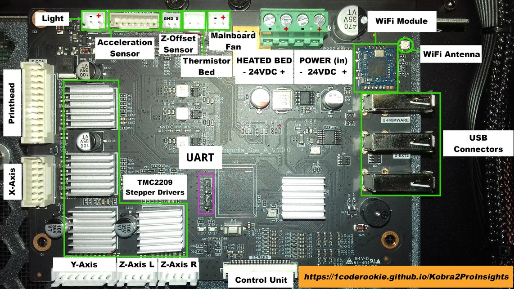
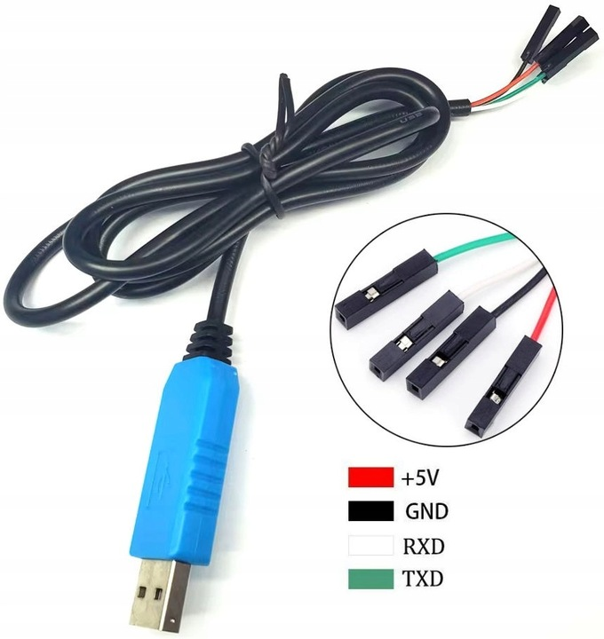
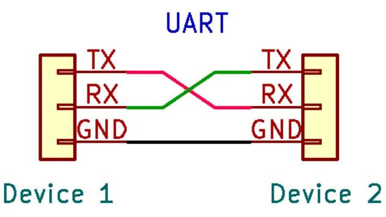

# UART

UART is a regular way how we can get a serial console to the printer to start modding it.

The serial console is available on the 4 pin header on the mainboard.



1. Downgrade to the original firmware version `2.3.9` (newer versions have the serial console disabled)
2. Connect UART cable to the printer motherboard. Don't conect the +5V pin, if you have one, as printer will boot partially from it, and you will not able to enter uboot.
   
   
3. Connect to the UART console with 115200 buad 8N1. Easiest with `tio`:
   ```shell
   $ tio /dev/ttyUSB0
   ```
4. To enter uboot press `s` key, while already connected to UART, and power on the printer. You should intercept the boot process, and hopefully you'll see:
   ```shell
   => ssssssssssssssssssssssss
   ```
   If so, you're in. You can now [root the printer](ROOT.md), make [eMMC backup](EMMC_BACKUP.md) or [restore it](EMMC_RESTORE.md).

> [!TIP]
> If you cannot see anything on the serial console it's probably because you run newer firmware. You need to downgrade to `2.3.9` first before you can get root access. This is due to Anycubic disabling the serial console in newer firmware versions in the uboot binary.
